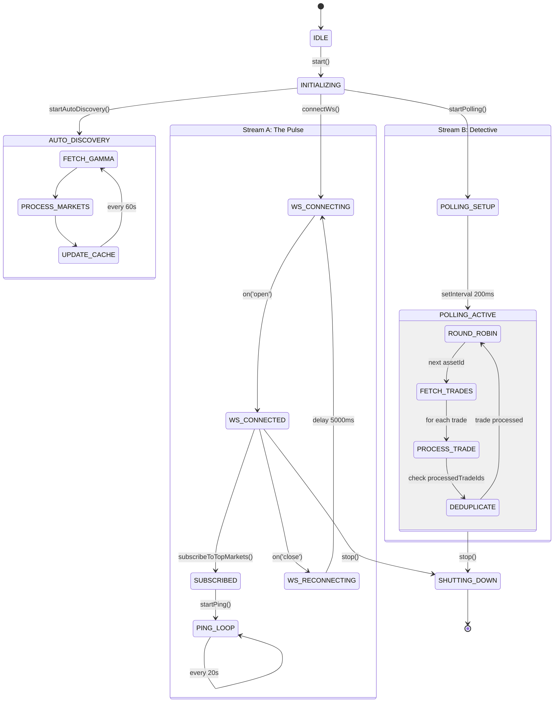
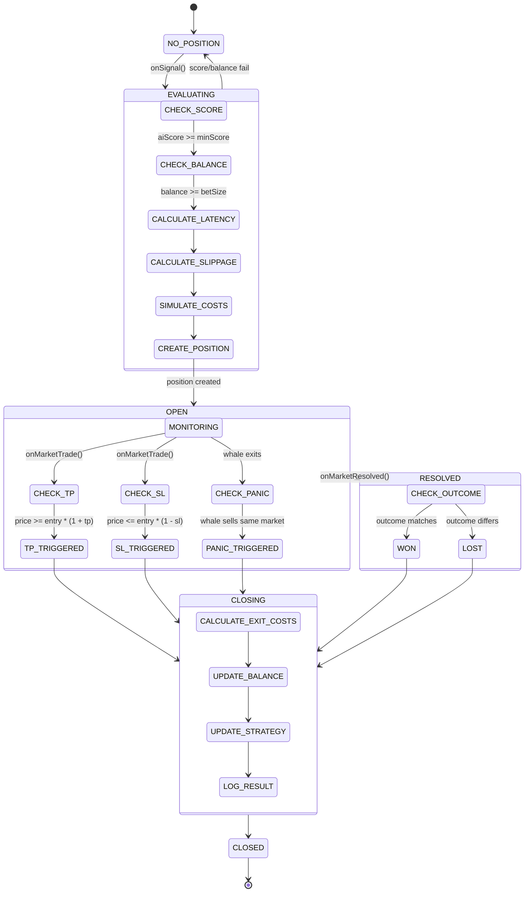
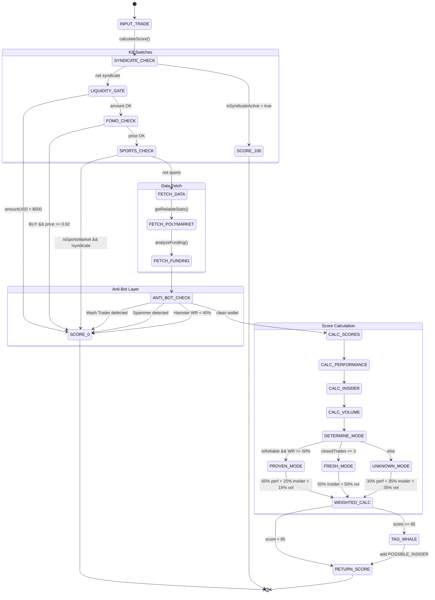
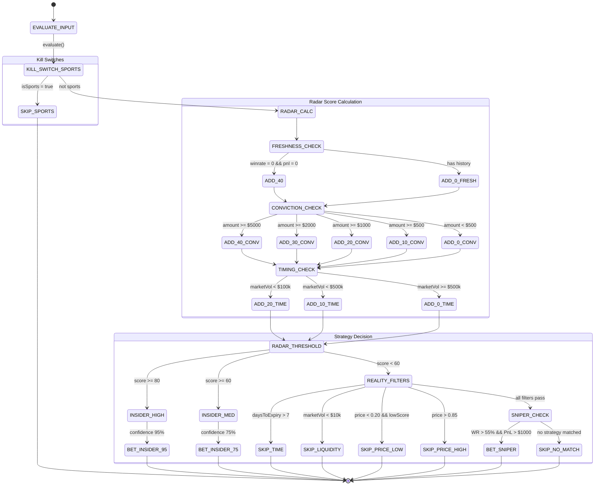
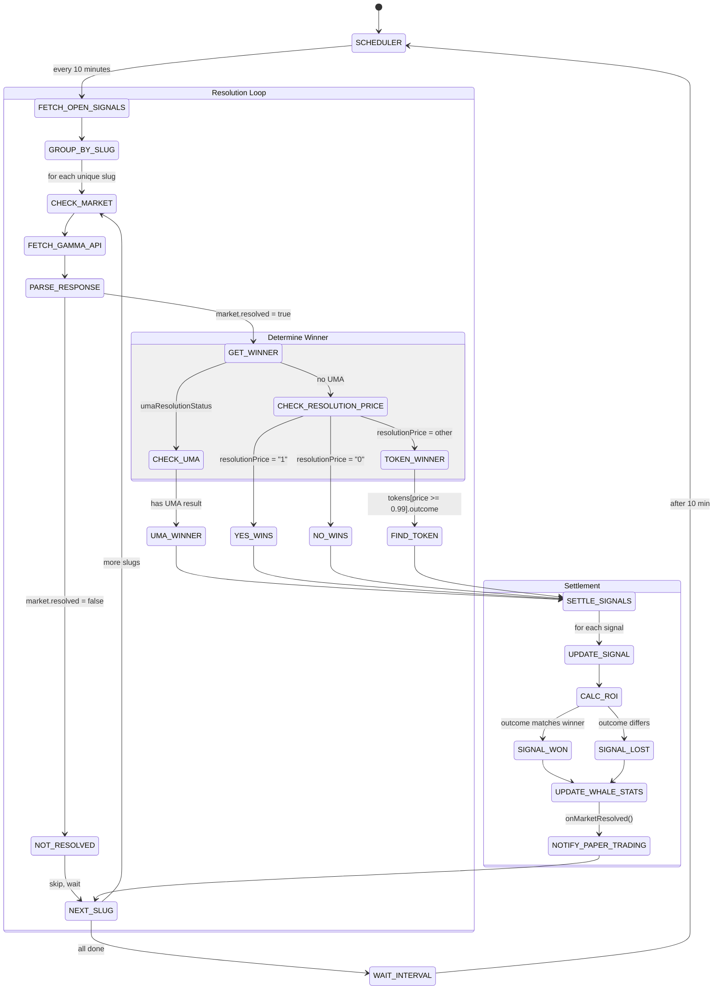
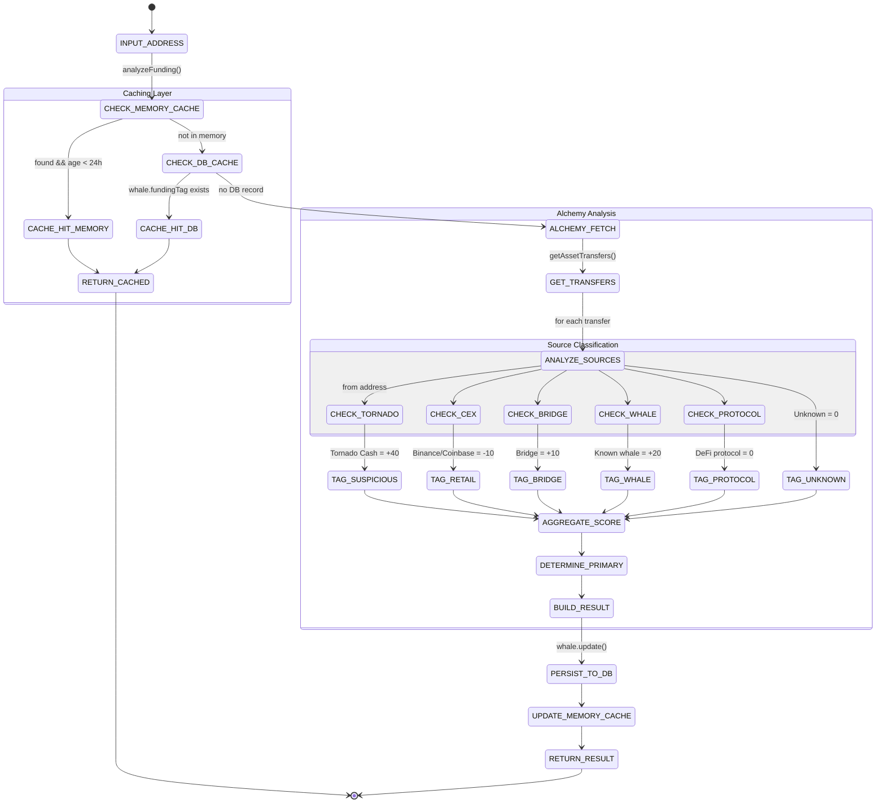
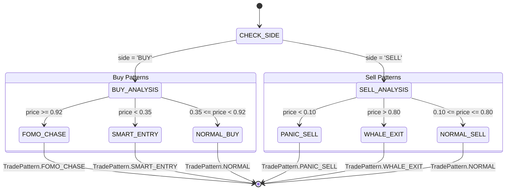
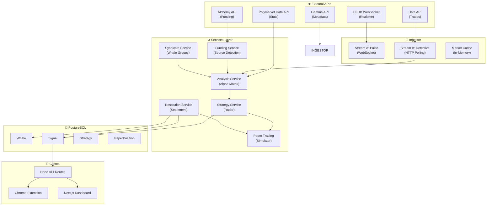

# 🐳 WhaleScope: State Machine Диаграммы

**Дата:** 2026-01-12  
**Версия:** 1.0  
**Сгенерировано на основе анализа исходного кода**

---

## 📋 Содержание

1. [Ingestor State Machine](#1-ingestor-state-machine)
2. [Paper Position Lifecycle](#2-paper-position-lifecycle)
3. [Analysis Service (Alpha Matrix)](#3-analysis-service-alpha-matrix)
4. [Strategy Service (Radar)](#4-strategy-service-radar)
5. [Signal Resolution](#5-signal-resolution)
6. [Funding Analysis](#6-funding-analysis)
7. [Trade Pattern Classification](#7-trade-pattern-classification)

---

## 1. Ingestor State Machine

Основной компонент сбора данных. Работает в двух потоках: WebSocket (Pulse) и HTTP Polling (Detective).



### Состояния Ingestor

| Состояние | Описание | Триггер перехода |
|-----------|----------|------------------|
| `IDLE` | Начальное состояние | Автоматически при создании |
| `INITIALIZING` | Запуск всех подсистем | `start()` |
| `WS_CONNECTING` | Подключение к WebSocket CLOB | `connectWs()` |
| `WS_CONNECTED` | Активное WebSocket соединение | `on('open')` |
| `POLLING_ACTIVE` | HTTP polling активен | `setInterval()` |
| `SHUTTING_DOWN` | Graceful shutdown | `stop()`, SIGTERM |

---

## 2. Paper Position Lifecycle

Жизненный цикл paper trading позиции от сигнала до закрытия.



### Exit Reasons

| Reason | Триггер | Формула PnL |
|--------|---------|-------------|
| `TP` | `price >= entry * (1 + tpPercent)` | `(exitPrice - entryPrice) * amount - costs` |
| `SL` | `price <= entry * (1 - slPercent)` | `(exitPrice - entryPrice) * amount - costs` |
| `PANIC` | Whale exits same market | Market exit price |
| `WON` | Market resolved, outcome matches | `amount * (1/entryPrice - 1)` |
| `LOST` | Market resolved, outcome differs | `-amount` |

---

## 3. Analysis Service (Alpha Matrix)

Скоринговый движок для оценки качества сигнала.



### Scoring Modes

| Mode | Условие | Веса |
|------|---------|------|
| `PROVEN` | `isReliable && WR >= 50%` | Perf 60%, Insider 25%, Volume 15% |
| `FRESH` | `closedTrades <= 3` | Insider 50%, Volume 50% |
| `UNKNOWN` | Default | Perf 30%, Insider 35%, Volume 35% |

---

## 4. Strategy Service (Radar)

Определение торговой стратегии на основе Radar Score.



### Radar Score Formula

```
RadarScore = Freshness (max 40) + Conviction (max 40) + Timing (max 20)

Freshness:
  - Fresh wallet (WR=0, PnL=0): +40
  - Proven wallet: +0

Conviction:
  - >= $5,000: +40
  - >= $2,000: +30
  - >= $1,000: +20
  - >= $500: +10

Timing:
  - Market vol < $100k: +20
  - Market vol < $500k: +10
```

---

## 5. Signal Resolution

Процесс settlement открытых сигналов.



### ROI Calculation

| Результат | Формула ROI |
|-----------|-------------|
| `WON` | `(1 - entryPrice) / entryPrice * 100%` |
| `LOST` | `-100%` |

---

## 6. Funding Analysis

Анализ источников финансирования кошелька.



### Funding Tags & Score Boosts

| Tag | Score Boost | Источники |
|-----|-------------|-----------|
| `SUSPICIOUS_INSIDER` | +40 | Tornado Cash, Mixers |
| `WHALE` | +20 | Known whale addresses |
| `BRIDGE` | +10 | Multichain, Stargate, Hop |
| `PROTOCOL` | 0 | DeFi protocols |
| `RETAIL` | -10 | Binance, Coinbase, Kraken |
| `UNKNOWN` | 0 | Unidentified sources |

---

## 7. Trade Pattern Classification

Классификация паттернов торговли.



### Pattern Thresholds

| Pattern | Side | Price Condition | Meaning |
|---------|------|-----------------|---------|
| `FOMO_CHASE` | BUY | `>= 0.92` | Buying near certainty, poor R/R |
| `SMART_ENTRY` | BUY | `< 0.35` | High upside potential |
| `PANIC_SELL` | SELL | `< 0.10` | Dumping at loss |
| `WHALE_EXIT` | SELL | `> 0.80` | Taking profits |
| `NORMAL` | Any | Between thresholds | Standard trading |

---

## 📊 Общая Архитектура



---

## 📁 Файлы исходного кода

| Компонент | Путь | Строк кода |
|-----------|------|------------|
| Ingestor | [ingestor.ts](file:///root/whalescope/apps/api/src/ingestor.ts) | 1053 |
| Paper Trading | [paper-trading.service.ts](file:///root/whalescope/apps/api/src/services/paper-trading.service.ts) | 533 |
| Analysis (Alpha Matrix) | [analysis.service.ts](file:///root/whalescope/apps/api/src/services/analysis.service.ts) | 312 |
| Strategy (Radar) | [strategy.service.ts](file:///root/whalescope/apps/api/src/services/strategy.service.ts) | 201 |
| Resolution | [resolution.service.ts](file:///root/whalescope/apps/api/src/services/resolution.service.ts) | 238 |
| Funding | [funding.service.ts](file:///root/whalescope/apps/api/src/services/funding.service.ts) | 387 |
